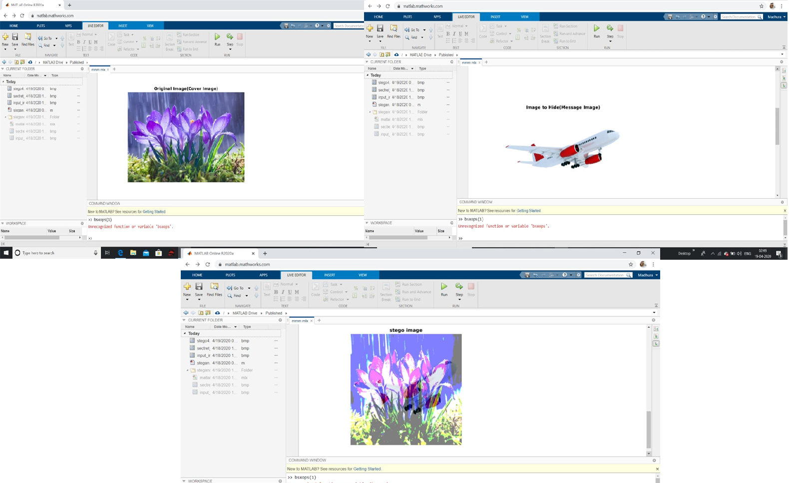

# Steganography_PDC_project

Steganography is the technique of hiding secret data within an ordinary, non-secret, file or message in 
order to avoid detection; the secret data is then extracted at its destination. The use of steganography can
be combined with encryption as an extra step for hiding or protecting data. The word steganography is derived from the
Greek words steganos (meaning hidden or covered) and the Greek root graph (meaning to write).

The main idea behind steganography is to hide the existence of a data in any medium like audio, video, image etc. 
When we talk about image steganography, the idea is quite simple. Images are made up of pixels which usually refer to
the color of that particular pixel. In a grey scale (black and white) image, these pixel values range from 0-255, 0 being 
black and 255 being white.

Some terminologies:

Cover-Image: An image in which the secret information is going to be hidden. The term "cover" is used to describe the original, innocent message, data, audio, still, video etc. The cover image is sometimes called as the "host".
Stego-Image: The medium in which the information is hidden. The "stego" data is the data containing both the cover image and the "embedded" information. Logically, the processing of hiding the secret information in the cover image is known as embedding.
Payload: The information which is to be concealed. The information to be hidden in the cover data is known as the "embedded" data.
Secret key: This is the key used as a password to encrypt and decrypt the cover and stego respectively in order to extract the hidden message. Secret key is optional.

Steps showing the encoding procedure:-

->Convert the image to grey scale and resize the image if needed

->Convert the message to its binary format

->Initialize output image same as input image

->Traverse through each pixel of the image and do the following:

->Convert the pixel value to binary

->Get the next bit of the message to be embedded and create a variable temp.

->If the message bit and the LSB of the pixel are same, set temp = 0
->If the message bit and the LSB of the pixel are different, set temp = 1
->This setting of temp can be done by taking XOR of message bit and the LSB of the pixel
->Update the pixel of output image to input image pixel value + temp
->Keep updating the output image till all the bits in the message are embedded
->Finally, write the input as well as the output image to local system.

  

